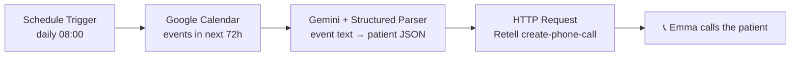

# n8n Dental Voice Agent

An AI voice agent that calls dental patients to confirm their appointments — built with n8n, Google Calendar, Gemini, and Retell AI.

Every morning, the workflow reads the clinic's calendar, extracts patient details with an LLM, and has **Emma** — a natural-sounding voice agent — call each patient. Emma reminds them of their appointment, asks if the time still works, and handles confirmations, reschedule requests, cancellations, and voicemail. No staff time spent on reminder calls. No robotic "press 1 to confirm."

## Demo

> 🎬 Demo video coming shortly — a real reminder call, from calendar event to phone ringing.

## Quickstart (5-minute setup)

1. Import [`n8n_dental_voice_agent.json`](./n8n_dental_voice_agent.json) into your n8n instance (self-hosted or cloud).

2. Replace the placeholders:
   - `+1XXXXXXXXXX` → your Retell phone number (Twilio-provisioned)
   - `YOUR_RETELL_AGENT_ID` → your Retell agent ID
   - `YOUR_CALENDAR_ID` → the Google Calendar holding your appointments

3. Connect three credentials in n8n:
   - **Google Calendar** — OAuth2
   - **Gemini** — API key
   - **Retell** — Custom Auth with `{"headers": {"Authorization": "Bearer <YOUR_RETELL_API_KEY>"}}`

4. Create a Retell agent with the prompt from [`retell-agent-prompt.md`](./retell-agent-prompt.md).

5. Add a calendar event containing a name, phone number (E.164), and reason. Activate the workflow. The phone rings.

## Why This Exists

### #1: No-Shows Are Expensive, Reminder Calls Are Boring

**The Problem.** Missed appointments cost clinics real money, and the fix — a staff member phoning every patient the day before — is repetitive work nobody wants. SMS reminders get ignored; a phone call doesn't.

**The Fix.** Automate the call, but keep it human. The workflow runs on a schedule, finds every appointment in the next 72 hours, and places a call that sounds like the clinic's front desk: *"Hi, this is Emma calling from the dental clinic — I'm calling about your check-up on Saturday at eleven."*

### #2: Calendar Events Are Messy, APIs Are Strict

**The Problem.** Real calendar events are free text. The phone number might be in the title, the description, formatted with spaces or a leading zero. Retell's API wants strict E.164 and structured variables.

**The Fix.** A Gemini-powered extraction step sits between the calendar and the phone call. It reads the raw event and emits validated JSON — `name`, `phone_number` (E.164), `reason`, `start_time`, `end_time` — enforced by a structured output parser. Garbage in, structure out.

### #3: Voice Agents Ramble

**The Problem.** Give an LLM a phone line and it will happily read out ISO timestamps, list every detail, and talk over the patient.

**The Fix.** Emma's prompt is deliberately narrow: two sentences per turn max, natural spoken dates ("Saturday, July fifth at eleven a.m."), a fixed conversation flow with explicit branches for confirm / reschedule / cancel / wrong number / voicemail, and a hard rule to deflect anything off-topic. See [`retell-agent-prompt.md`](./retell-agent-prompt.md).

## How It Works

| Step | Node | What it does |
|------|------|--------------|
| 1 | Schedule Trigger | Fires daily at 08:00 |
| 2 | Google Calendar | Fetches all appointments in the next 72 hours |
| 3 | AI Agent (Gemini) | Extracts structured patient details from free-text events |
| 4 | Structured Output Parser | Enforces the JSON schema |
| 5 | HTTP Request | `POST /v2/create-phone-call` with per-call dynamic variables |
| 6 | Retell AI | Places the call and runs Emma's conversation |

The patient's details are injected into Emma's prompt per-call via `retell_llm_dynamic_variables` — one agent, personalized for every patient.

> [!TIP]
> Calling internationally? Retell's Twilio-provisioned numbers can dial 15 countries out of the box (Germany included, +$0.10/min). Set **Allowed Outbound Countries** on your Retell number and make sure `to_number` is strict E.164 — `+4915123456789`, no spaces, no leading zero.

## Roadmap

- **In-call rescheduling** — Emma checks real calendar availability mid-call and offers slots one at a time, the way a human receptionist would ("Would Tuesday at 3 work instead?") — no technical vocabulary required from the patient.
- **Closing the loop** — post-call webhook back into n8n with the call outcome (confirmed / reschedule / cancelled / no answer), updating the calendar automatically.
- **Call outcome dashboard** — daily summary of confirmations and cancellations for the clinic.

## Reference

- **[`n8n_dental_voice_agent.json`](./n8n_dental_voice_agent.json)** — the n8n workflow (sanitized; see Quickstart for placeholders)
- **[`retell-agent-prompt.md`](./retell-agent-prompt.md)** — Emma's full voice-agent prompt and the Retell-side configuration notes
- **[`docs/GLOSSARY.md`](./docs/GLOSSARY.md)** — the project's shared language
- **[`docs/adr/`](./docs/adr/)** — architecture decision records: why the repo is shaped the way it is

## License

[MIT](./LICENSE)
